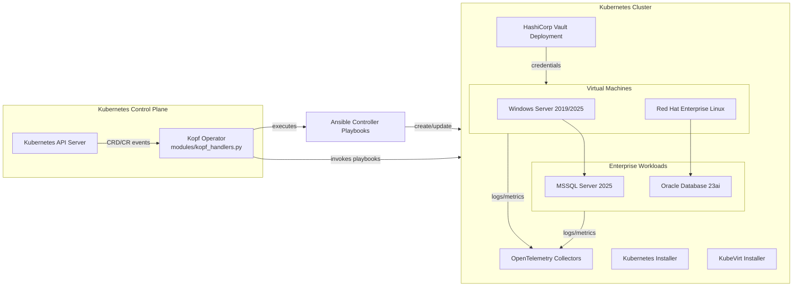
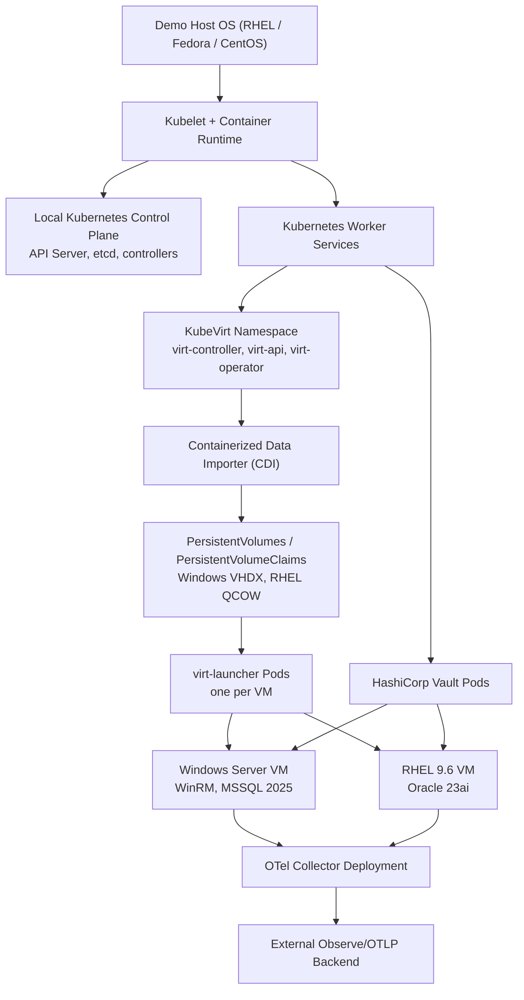

# Kubernetes Installer Platform

End-to-end automation for building a KubeVirt-based virtual infrastructure on top of a Red Hat Kubernetes stack, provisioning enterprise workloads, and wiring telemetry with OpenTelemetry (OTel).

The project combines two complementary entry points:

1. **Controller playbooks** – stand-alone Ansible playbooks that can be run sequentially or individually.
2. **Kopf operator & TUI** – a Python-based operator entry point (`kopf_opeartor.py`) that ships with an interactive urwid TUI (`modules/tui_interface.py`) and an optional headless `--operator-only` mode. Both paths expose Custom Resources (CRDs/CRs) to drive the same playbooks declaratively.

## 🏗️ High-Level Architecture



## Component Stack

| Layer | Purpose | Key Artifacts |
| --- | --- | --- |
| **Kubernetes foundation** | Bootstraps the Red Hat Kubernetes control plane needed by everything else. | `k8s-redhat-kubernetes-controller.yaml` |
| **Virtualization (KubeVirt)** | Adds KubeVirt to host Windows and RHEL virtual machines inside Kubernetes. | `k8s-redhat-kubevirt-controller.yaml` |
| **Secrets (HashiCorp Vault)** | Provides secret storage for Windows admin passwords, MSSQL secrets, etc. | `hashicorp-vault-service-controller.yaml`, `hashicorp-vault-service/` | 
| **Virtual machine workloads** | Provisions Windows Server (2019/2025) and RHEL 9.6 images via KubeVirt. | `windows-server-controller.yaml`, `windows-server-unified-controller.yaml`, `redhat-server-controller.yaml` |
| **Application workloads** | Layered installs for Microsoft SQL Server 2025 on Windows and Oracle 23ai on RHEL. | `windows-automation-controller.yaml`, `oracle-controller.yaml`, `oracle/` |
| **Telemetry** | Deploys OTel collectors and per-workload pipelines for unified observability. | `otel-controller.yaml`, `otel/` |
| **Operator mode** | Kopf runtime + TUI console that translates CRs into playbook runs for GitOps-style automation. | `kopf_opeartor.py`, `modules/` |

## 🖥️ Standalone Host Layering

The demo environment can run on a single physical or virtual host. The following diagram shows how the stack is assembled from the operating system up to the application telemetry pipelines.



### Storage & VM imaging

* **Containerized Data Importer (CDI)** pulls base images (for example, `win2025server.vhdx`, `rhel-9.6-x86_64-kvm.qcow2`) into `PersistentVolumeClaims`.
* Each VM receives a dedicated PVC mounted into its `virt-launcher` pod.
* Additional `ConfigMap`/`Secret` mounts provide unattended installation scripts and credentials.

### Vault-backed secrets

* Vault runs in the `hashicorp-vault` namespace.
* Windows, MSSQL, and Oracle playbooks request credentials via the Vault HTTP API. Tokens are injected through environment variables or read from token files.
* `Secret` objects created by the playbooks are mounted into pods needing application credentials (for example, OTel collector exporters).

### Observability flow

1. Windows and RHEL VMs expose metrics/logs through sidecar agents installed by the playbooks.
2. The OTel collector consolidates and forwards data to the configured OTLP destination (Observe, Splunk, etc.).
3. MSSQL, Oracle, and Vault pipelines include authentication secrets handled via Vault.

## Deployment Workflow

The typical path from bare cluster to fully instrumented workloads:

1. **Install Red Hat Kubernetes** – provides the control plane where everything runs.
2. **Add KubeVirt** – enables VM orchestration inside the cluster.
3. **Deploy HashiCorp Vault** – secret backend for Windows and database credentials.
4. **Provision VMs** – deploy Windows Server (2019/2025) and RHEL VMs via KubeVirt.
5. **Install application payloads** – MSSQL 2025 atop Windows, Oracle 23ai atop RHEL.
6. **Activate telemetry** – install the OTel collector(s) and pipeline components.

Each step can be executed manually via Ansible or driven declaratively through CRs handled by the Kopf operator.

## Operating Modes

### 1. Running Controller Playbooks Directly

All commands are executed from the repository root (no absolute paths required).

```bash
# 1. Install Kubernetes
ansible-playbook k8s-redhat-kubernetes-controller.yaml -e k8s_action=install

# 2. Install KubeVirt
ansible-playbook k8s-redhat-kubevirt-controller.yaml -e kubevirt_action=install

# 3. Deploy HashiCorp Vault
ansible-playbook hashicorp-vault-service-controller.yaml -e action=install

# 4. Provision Windows Server 2025 VM
ansible-playbook windows-server-unified-controller.yaml -e action=install -e windows_version=2025

# 5. Provision RHEL VM (example)
ansible-playbook redhat-server-controller.yaml -e action=install

# 6. Install MSSQL 2025 on the Windows VM
ansible-playbook windows-automation-controller.yaml -e install=mssql

# 7. Install Oracle 23ai on the RHEL VM
ansible-playbook oracle-controller.yaml -e action=install

# 8. Deploy OTel stack (collector + pipelines)
ansible-playbook otel-controller.yaml -e action=install -e otel_install_components='["collector","windows","redhat","vault","oracle","mssql"]'
```

**Tips**

* Override any default value with `-e key=value` (for example, `-e windows_admin_password=StrongP@ss1`).
* Provide unique OTLP tokens per pipeline (`windows_otel_token`, `redhat_otel_token`, etc.).
* Vault integration expects either `vault_token` or a readable token file; see the playbook docstrings for details.

### 2. Kopf Operator & TUI Console

`kopf_opeartor.py` is the unified entry point for the urwid-based console and the Kopf operator workers that reconcile CRDs/CRs.

#### Launch the interactive console

```bash
python kopf_opeartor.py
```

Running the script without flags loads the kubeconfig, spawns the Kopf operator in a background thread, and opens the full-screen TUI defined in `modules/tui_interface.py`. Key capabilities include:

* **Interactive CRD/CR lifecycle** – dedicated menus (*Apply CRDs*, *Apply CRs*, *Delete CR*, *Delete CRD*) that walk you through every YAML in `manifest-controller/` without typing commands.
* **Consolidated status board** – live view of deployed CRDs/CRs, grouped by service domain (VMs, MSSQL, OTel) with health indicators.
* **Streaming logs** – the TUI tails the shared `log_queue`, so operator/TUI messages remain visible without switching terminals.
* **Service actions** – integrate with `modules/service_managers.py` to trigger playbook workflows directly from the console.

Use this mode when you want an operator cockpit on the demo host or when bootstrapping interactively—no manual `kubectl` required.

#### Headless `--operator-only` mode

```bash
python kopf_opeartor.py --operator-only
```

The `--operator-only` switch starts the same Kopf reconcilers but skips the TUI entirely. Console logging stays enabled (see `modules/utils/logging_config.py`), making it ideal for:

* Running in CI/CD pipelines or GitOps controllers.
* Packaging the operator into a container image.
* Remote environments where an ncurses/urwid UI is not available.

In this mode you must manage CRDs/CRs yourself from the `manifest-controller/` directory:

```bash
# Apply (create/update) a definition
kubectl apply -f manifest-controller/windows-server-vm-crd.yaml
kubectl apply -f manifest-controller/windows-server-vm-cr.yaml

# Delete a resource/definition
kubectl delete -f manifest-controller/windows-server-vm-cr.yaml
kubectl delete -f manifest-controller/windows-server-vm-crd.yaml
```

Repeat for the other manifests (`mssqlserver-crd.yaml`, `mssqlserver-cr.yaml`, `otel-telemetry-crd.yaml`, etc.) as needed.

#### Declarative GitOps workflow (CRDs/CRs)

Whether you use the interactive console or headless mode, the overall workflow is the same:

1. **Deploy CRDs** – files live in `manifest-controller/` (for example `mssqlserver-crd.yaml`, `windows-server-vm-crd.yaml`, `otel-telemetry-crd.yaml`). The TUI exposes an *Apply CRDs* menu, or run `kubectl apply -f …` manually.
2. **Start the operator** – launch `kopf_opeartor.py` (with or without `--operator-only`). The handler implementations reside in `modules/kopf_handlers.py`.
3. **Apply CRs** – use the TUI’s *Apply CRs* menu or `kubectl apply` to submit manifests such as `windows-server-vm-cr.yaml`, `mssqlserver-cr.yaml`, `otel-telemetry-cr.yaml`.

Example: install full telemetry via CRs using CLI commands

```bash
kubectl apply -f manifest-controller/windows-server-vm-crd.yaml
kubectl apply -f manifest-controller/mssqlserver-crd.yaml
kubectl apply -f manifest-controller/otel-telemetry-crd.yaml

kubectl apply -f manifest-controller/windows-server-vm-cr.yaml
kubectl apply -f manifest-controller/mssqlserver-cr.yaml
kubectl apply -f manifest-controller/otel-telemetry-cr.yaml
```

Once running, the operator:

* Watches for resource events.
* Resolves variables via `modules/utils/var_helpers.py` (CLI overrides, environment variables, CR spec, defaults).
* Invokes the same Ansible playbooks used in manual mode.
* Updates status fields (`phase`, `message`, `conditions`) to reflect progress.

### Kopf vs. Playbook quick comparison

| Capability | Playbook mode | Operator mode |
| --- | --- | --- |
| Execution style | Imperative, ad-hoc | Declarative, event-driven |
| GitOps friendliness | Manual sequencing | CR commits trigger lifecycle |
| Status tracking | CLI output/logs | CR `.status` fields, events |
| Extensibility | Edit playbooks | Extend handlers (`modules/`) |

## Telemetry & Observability

The OTel controller orchestrates:

* Core collector deployment (`otel/otel-collector-install.yaml`).
* Optional pipelines (Vault, Windows, RHEL, Oracle, MSSQL) driven by component selection.
* Vault integration for secrets (e.g., retrieving Windows admin passwords securely).

Provide per-component endpoints/tokens when installing:

```bash
ansible-playbook otel-controller.yaml \
  -e action=install \
  -e component="collector,windows,mssql" \
  -e windows_otel_endpoint="https://observe.example.com/v2/otel" \
  -e windows_otel_token="WINDOWS_TOKEN" \
  -e mssql_otel_endpoint="https://observe.example.com/v2/otel" \
  -e mssql_otel_token="MSSQL_TOKEN"
```

Use the same keys when defining the `OTelTelemetry` CR; the handler automatically respects environment-variable overrides for safe secret injection.

## Custom Resources & Controllers

The Kopf operator translates Kubernetes Custom Resources into playbook executions. The repository includes both the CRD definitions and sample CRs. The following tables summarize the resources.

### Custom Resource Definitions (CRDs)

| CRD file | Resource Kind | Purpose |
| --- | --- | --- |
| `manifest-controller/windows-server-vm-crd.yaml` | `WindowsServerVM` | Describes Windows VM lifecycle (install/uninstall/status) on KubeVirt. |
| `manifest-controller/redhatvm-crd.yaml` | `RedHatVM` | (Optional) Tracks Red Hat VM provisioning tasks. |
| `manifest-controller/mssqlserver-crd.yaml` | `MSSQLServer` | Automates MSSQL Server install on a target Windows VM. |
| `manifest-controller/oracle-db-crd.yaml` | `OracleDB` | Automates Oracle Database 23ai deployment on a RHEL VM. |
| `manifest-controller/otel-telemetry-crd.yaml` | `OTelTelemetry` | Declarative definition of telemetry components and destinations. |
| `manifest-controller/win2025-admin-policy.hcl` | (Vault policy) | Example policy for Vault integration used by playbooks. |

### Sample Custom Resources (CRs)

| CR file | Kind | Highlights |
| --- | --- | --- |
| `manifest-controller/windows-server-vm-cr.yaml` | `WindowsServerVM` | Specifies VM name, namespace, storage defaults, Vault secret path for admin password. |
| `manifest-controller/rhel9-redhatvm-cr.yaml` | `RedHatVM` | Example RHEL VM declaration pointing to the QCOW2 disk. |
| `manifest-controller/mssqlserver-cr.yaml` | `MSSQLServer` | Configures MSSQL install (installer paths, credential vault paths). |
| `manifest-controller/oracle-db-cr.yaml` | `OracleDB` | Declares Oracle VM target, listener port, passwords, and metrics settings. |
| `manifest-controller/otel-telemetry-cr.yaml` | `OTelTelemetry` | Enables collector + component pipelines and sets OTLP endpoints/tokens. |

When these CRs are applied:

1. Kopf watches for create/update/delete events.
2. Handlers in `modules/kopf_handlers.py` resolve desired state.
3. Corresponding playbooks run with merged variables (env overrides > CR spec > defaults).
4. Status updates are written back to the CR `.status` fields for visibility.

## HashiCorp Vault Integration

* **Install** via `hashicorp-vault-service-controller.yaml`.
* Vault secrets store Windows admin passwords (`secret/data/windows-server-2025/admin` by default) and database credentials.
* Playbooks look for `vault_token` or `VAULT_TOKEN` env vars, falling back to `/root/.vault-token` if present.
* Kopf handlers avoid passing empty strings to Ansible, so Vault defaults remain effective.

## Repository Layout (highlights)

```
├── kubernetes/                 # Kubernetes lifecycle task files
├── kubevirt/                   # KubeVirt lifecycle task files
├── hashicorp-vault-service/    # Vault deployment manifests
├── windows-server/             # Windows VM task includes
├── redhat-server/              # Red Hat VM task includes
├── oracle/                     # Oracle DB install/status/uninstall
├── otel/                       # OTel collector + component pipelines
├── manifest-controller/        # CRD/CR examples for Kopf mode
├── modules/                    # Python helpers for Kopf operator
├── windows-automation-controller.yaml   # MSSQL 2025 automation
├── oracle-controller.yaml               # Oracle 23ai automation
├── otel-controller.yaml                  # OTel deployment controller
├── kopf_opeartor.py                      # Operator/TUI entry point
└── requirements.txt                      # Python dependencies for Kopf mode
```

## Prerequisites

* Control host with Ansible 2.14+ and Python 3.9+.
* Access to a Red Hat-compatible Kubernetes cluster (for example, OpenShift or ROSA) with cluster-admin privileges.
* Proper Red Hat / Microsoft / Oracle licensing or evaluation media.
* Optional: Observe/OTel backend credentials for telemetry ingestion.

## Operational Guidelines

1. **Plan capacity:** The Windows and Oracle workloads require substantial CPU/RAM. Ensure KubeVirt nodes can host them concurrently.
2. **Network access:** Windows and RHEL guests may require outbound internet for package downloads unless you pre-stage media.
3. **Credential storage:** Use Vault for long-lived secrets. The playbooks can also consume environment variables for overrides during CI/CD runs.
4. **Immutability:** Treat CR manifests as the source of truth. Changes to spec fields trigger reconcilers that make the cluster match the desired state.

## Troubleshooting

| Symptom | Common Cause | Remedy |
| --- | --- | --- |
| Kopf reports *unresolved resources* | CRDs not applied before operator start | Apply CRDs from `manifest-controller/` prior to launching Kopf |
| Windows VM fails to retrieve password | Missing Vault token or incorrect secret field | Supply `vault_token` / `VAULT_TOKEN`, or ensure the secret path contains the `password` key |
| MSSQL/Oracle installers hang on WinRM/SSH | VM not ready or credentials incorrect | Check VM status via `virtctl console` / `kubectl get vmi`, review playbook logs |
| OTel components complain about duplicate tokens | Shared OTLP token across pipelines | Provide unique `*_otel_token` values per pipeline |
| Stuck VM deletion | Finalizer not removed or VM offline | Use `./cleanup-stuck-vm.sh` to clear leftovers |

## Extending the Platform

* Add new workloads by creating an Ansible role/playbook and wiring it into a new Kopf handler + CRD.
* Use `modules/service_managers.py` as a template for orchestrating complex services.
* For additional telemetry pipelines, extend `otel/` with new includes and adjust `_build_oteltelemetry_playbook`.

---

This README provides the architecture, operating modes, and practical workflows needed to run the **kubernetes-installer** project on any filesystem path. Clone the repository, run playbooks directly, or let the Kopf operator reconcile CRs—the choice depends on your automation strategy.
